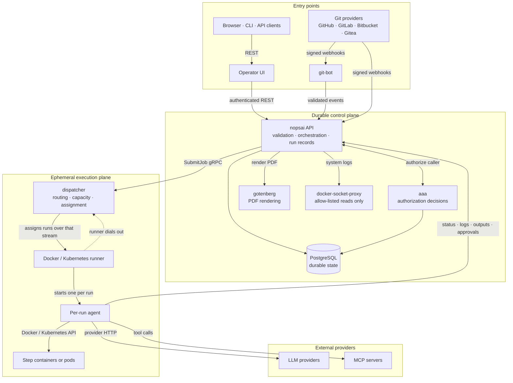

<p align="center">
  <picture>
    <source media="(prefers-color-scheme: dark)" srcset="services/ui/public/brand/nopsai-banner-dark.png">
    
  </picture>
</p>

# NopsAI

NopsAI is a self-hosted platform for building, governing, and running AI-assisted engineering and operational workflows.

It enables platform, DevOps, and Engineering teams to combine:

- Deterministic scripts and commands
- LLM models
- MCP tools
- Agent roles
- Knowledge context synced from Notion and Confluence (Guardrails, ADRs, Policies, Docs, and etc.)
- Team level managed resources
- pipeline in pipeline calls
- Create and update Dashboards and files from pipeline by prompt
- Gitops Oriented
- Docker and Kubernetes runners

NopsAI controls which models, tools, credentials, resources, and environments a workflow can access and preserves a durable, auditable record of each execution.

It is CI/CD-shaped, but the configuration, access, and AI controls are built for
production operations: encrypted secrets, scoped variables, governed knowledge
documents, per-run isolation, GitOps-managed definitions, and a full audit
trail.

Everything runs on your infrastructure. There is no NopsAI-operated service.

## What a pipeline looks like

```yaml
name: release-service
container_image: alpine/git:latest
model: standard
steps:
  - name: build
    script: make build && make test

  - name: release-notes
    depends_on: [build]
    goal: Read the commits since the last tag and write release notes to /workspace/NOTES.md.

  - name: production-gate
    depends_on: [release-notes]
    approval:
      type: production-release
      teams: [platform/sre]
      timeout: 24h

  - name: deploy
    depends_on: [production-gate]
    script: ./deploy.sh

output:
  items:
    - name: Release summary
      type: markdown
      when: always
      prompt: Summarize the release, its approvals, and anything that failed.
```

Four things worth noticing:

- **Steps run in dependency order, not list order.** Independent branches run
  concurrently up to runner capacity.
- **`goal:` is an LLM-backed step.** It resolves through the named Model,
  and AAA still decides whether the caller may use that profile.
- **`approval:` is a durable checkpoint.** The run pauses and releases runner
  capacity rather than holding it, and survives a restart.
- **`output:` runs after execution.** Deliverables can be Markdown, JSON, HTML,
  PDF, Excel, or a dashboard publication.

More examples live in [`examples/`](examples/README.md): one GitOps sample with a
global and a team config repository in
[examples/gitops-quickstart/README.md](examples/gitops-quickstart/README.md),
and SSO fixtures under [examples/sso](examples/sso/README.md).

## Quick start

### From a published release

Install the latest published CLI from
<https://github.com/nopsai/nopsai/releases/latest>, then run the installer:

```bash
version="$(curl -fsSL https://api.github.com/repos/nopsai/nopsai/releases/latest | sed -nE 's/.*"tag_name": *"v?([^"]+)".*/\1/p' | head -1)"
[ -n "$version" ] || { echo "Could not resolve latest NopsAI release" >&2; exit 1; }
os="$(uname -s | tr '[:upper:]' '[:lower:]')"
arch="$(uname -m)"
case "$os" in linux|darwin) ;; *) echo "Unsupported OS: $os" >&2; exit 1 ;; esac
case "$arch" in x86_64|amd64) arch=amd64 ;; arm64|aarch64) arch=arm64 ;; *) echo "Unsupported architecture: $arch" >&2; exit 1 ;; esac
archive="nopsai-cli_${version}_${os}_${arch}.tar.gz"
base_url="https://github.com/nopsai/nopsai/releases/download/v${version}"

curl -fL "$base_url/$archive" -o "$archive"
curl -fL "$base_url/SHA256SUMS" -o SHA256SUMS
checksum_line="$(awk -v asset="$archive" '{ name=$2; sub(/^\*/, "", name); sub(/^\.\//, "", name); if (name == asset) print $0 }' SHA256SUMS)"
[ -n "$checksum_line" ] || { echo "Missing checksum for $archive" >&2; exit 1; }
if command -v sha256sum >/dev/null 2>&1; then
  printf '%s\n' "$checksum_line" | sha256sum -c -
else
  printf '%s\n' "$checksum_line" | shasum -a 256 -c -
fi
tar -xzf "$archive" nopsai
sudo install -m 0755 nopsai /usr/local/bin/nopsai
rm -f "$archive" SHA256SUMS nopsai

nopsai install
```

Windows users can download `nopsai-cli_<version>_windows_amd64.zip` from the
same latest release page, extract `nopsai.exe` onto `PATH`, and delete the zip.

The wizard asks for Docker Compose or Kubernetes and generates the install files
for the version you select — a Compose file, `.env`, and database seed, or Helm
values referencing the versioned OCI chart. After the first install, upgrade the
CLI with `nopsai update --version <version>` so the CLI verifies the downloaded
archive and checksum before replacing itself. See [doc/cli.md](doc/cli.md).

### From this checkout

The checked-in Compose file ships no fallback credentials. Set the bootstrap
secrets first — Compose fails fast if any are missing:

```bash
POSTGRES_PASSWORD=$(openssl rand -hex 16)
cat >> .env <<EOF
POSTGRES_PASSWORD=$POSTGRES_PASSWORD
DATABASE_URL=postgres://nopsai:$POSTGRES_PASSWORD@db:5432/nopsai?sslmode=disable
NOPSAI_MASTER_KEY=$(openssl rand -hex 32)
JWT_SIGNING_KEY=$(openssl rand -hex 32)
SERVICE_JWT_SIGNING_KEY=$(openssl rand -hex 32)
AAA_SHARED_INTERNAL_TOKEN=$(openssl rand -hex 32)
NOPSAI_BOOTSTRAP_ADMIN_PASSWORD=$(openssl rand -hex 12)
EOF

docker compose up -d --build
```

`JWT_SIGNING_KEY` and `SERVICE_JWT_SIGNING_KEY` must be different values, so a
user token cannot impersonate a service.

| Surface | Address |
| --- | --- |
| UI | http://localhost |
| API | http://localhost:8080 |
| git-bot | http://localhost:8081 |
| dispatcher (gRPC) | localhost:9091 |
| Postgres | localhost:5432 |

Published ports bind to `127.0.0.1` by default through `NOPSAI_BIND_ADDRESS`.

Sign in as `NOPSAI_BOOTSTRAP_ADMIN_EMAIL` (default `admin@example.com`) with the
`NOPSAI_BOOTSTRAP_ADMIN_PASSWORD` you set. The first login forces a password
rotation. Then run **System > Setup**.

That is as far as this file goes. The walkthrough continues in the in-app wiki
under **Getting started**, which takes you from here through the topology, a
Docker runner, a three-step pipeline that passes values between steps, a scoped
variable and secret, a trigger, and reading the run — each step with a command
that confirms it worked.

To stop and drop local state:

```bash
docker compose down -v
```

Compose is for evaluation and development. For anything shared, work through
the production hardening checklist in the wiki first.

## Documentation

**In the app.** Every install ships a Product Wiki at `/docs`. It opens with a
**Getting started** walkthrough, then a **Pipelines** chapter that introduces one
capability per page on a single manifest that grows as you read, sections for
**Automation**, **Platform** and **Operations**, a per-area **API** reference,
and a **Reference** section with complete indexes of every YAML directive,
environment variable, and REST endpoint. It is the fastest way to answer "what
does this directive do?" or "which endpoint is that?".

**In this repository.** [`doc/`](doc/README.md) holds the code-grounded
documentation set:

| I want to… | Read |
| --- | --- |
| Understand the system | [architecture-overview.md](doc/architecture-overview.md), [service-reference.md](doc/service-reference.md) |
| Know why it is built this way | [decision-architecture.md](doc/decision-architecture.md) |
| Trace what happens during a run | [runtime-flows.md](doc/runtime-flows.md) |
| Write pipelines | [feature-reference.md](doc/feature-reference.md), [examples/](examples/README.md) |
| Call the API | [api.md](doc/api.md) |
| Use the CLI | [cli.md](doc/cli.md) |
| Set up access and identity | [access-control.md](doc/access-control.md), [jwt-authentication.md](doc/jwt-authentication.md) |
| Manage secrets | [credential-management.md](doc/credential-management.md) |
| Configure Git integration | [git-apps.md](doc/git-apps.md), [git-webhook-sources.md](doc/git-webhook-sources.md) |
| Configure AI | [llm-model-selection.md](doc/llm-model-selection.md), [agent-roles.md](doc/agent-roles.md), [knowledge-context.md](doc/knowledge-context.md), [mcp-pipeline-integration.md](doc/mcp-pipeline-integration.md) |
| Deploy to Kubernetes | [kubernetes-runner.md](doc/kubernetes-runner.md), [release-bundles.md](doc/release-bundles.md) |
| Harden for production | [enterprise-gates.md](doc/enterprise-gates.md) |
| Operate it | [system-logs.md](doc/system-logs.md), [dashboards.md](doc/dashboards.md) |

## Architecture

A control plane owns state and decisions; an execution plane runs the work.



Two things the picture is meant to make obvious:

- **Runners dial out.** The runner opens the long-lived stream to the dispatcher
  and work is assigned back over it, so a runner never needs inbound network
  access.
- **Only the control plane is durable.** Runners, agents, and step containers are
  disposable; everything that must survive a restart is in PostgreSQL.

| Service | Owns |
| --- | --- |
| `services/nopsai` | REST API, validation, orchestration, config sync, run records, setup |
| `services/aaa` | Authorization decisions, policy checks, ACL expansion, decision audit |
| `services/dispatcher` | Runner registration, queueing, routing, capacity, job assignment |
| `services/git-bot` | GitHub App webhooks, repository access, check runs |
| `services/agent` | Per-run orchestration, LLM calls, step execution, log streaming |
| `services/docker-runner`, `services/k8s-runner` | Runner implementations |
| `services/ui` | Operator UI and the in-app wiki |
| `cmd/nopsai-cli` | Operator CLI and interactive console |

## Repository layout

```text
cmd/                    User-facing command entrypoints
config/                 Runtime configuration loader
container/              Service Dockerfiles
db/                     Postgres schema and seed data
deploy/helm/            Helm chart
doc/                    Code-grounded documentation set
examples/               Runnable pipelines, GitOps sample repo, SSO fixtures
internal/cli/           CLI config, REST client, API catalog, interactive console
pkg/                    Shared models, protobuf contracts, service auth, TLS
release/                Version and compatibility contract
scripts/                Build, test, release, and license gates
services/               Platform services (see table above)
test/                   Local operational and performance scripts
```

## Development

Build the binaries:

```bash
go build -o nopsai ./cmd/nopsai-cli
go build -o nopsai-api ./services/nopsai/cmd/nopsai
```

Run backend tests. The script excludes `services/ui` so an installed
`node_modules` tree cannot be mistaken for part of the Go module:

```bash
scripts/test-backend.sh
```

Run UI checks:

```bash
cd services/ui
npm ci
npm run lint
npm run test
npm run build
```

Run the commercial dependency license gate:

```bash
scripts/license-check.sh
```

Build and push the Kubernetes runner image:

```bash
docker compose build base k8s-runner
docker compose --profile images push k8s-runner
```

See [doc/package-ownership.md](doc/package-ownership.md) for where new code
belongs, and [services/ui/src/README.md](services/ui/src/README.md) for the UI
placement rules.

## Project status

This repository contains the NopsAI product implementation and its deployment
shape. The documentation describes the current codebase, not a roadmap. The
in-app wiki page **Reference → Confirmed gaps and limits** lists what
the platform deliberately does not do yet; [doc/wiki](doc/wiki) is the
repository-side source map that keeps it honest.

## License

NopsAI is published under the [PolyForm Noncommercial License 1.0.0](LICENSE).
Copyright (c) 2026 Hossein Yousefi.

**Free for any non-commercial purpose** — personal use, study, research,
experimentation, hobby projects, and use by charitable, educational, public
research, public safety, health, environmental and government organizations. No
key, no registration, no limits on users, teams or runs.

**Commercial use requires a written agreement.** Running NopsAI in or for a
business, or for any other commercial purpose, is not granted by the public
licence. Email contact@nopsai.com and we will sort it out; the agreement, Order
Form and support data processing terms are in [legal/](legal/).

Third-party components keep their own terms — see
[THIRD_PARTY_NOTICES.md](THIRD_PARTY_NOTICES.md). Security issues go to
contact@nopsai.com — see [SECURITY.md](SECURITY.md).
