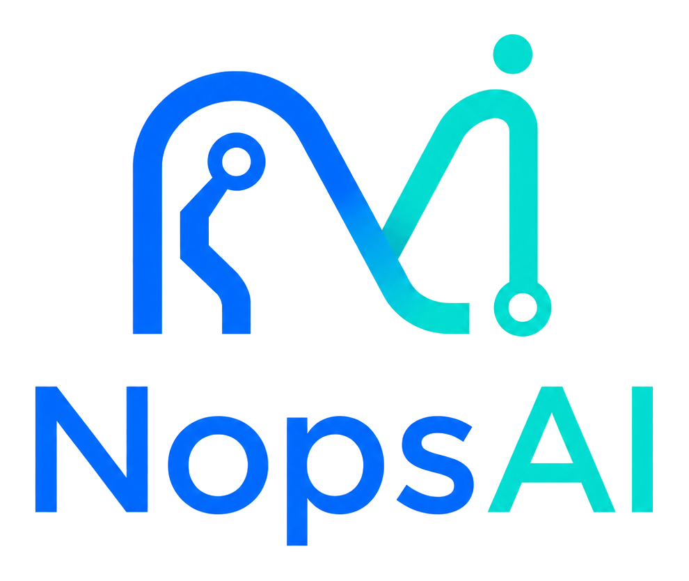

<p align="center">
  <picture>
    <source media="(prefers-color-scheme: dark)" srcset="services/ui/public/brand/nopsai-logo-dark.png">
    
  </picture>
</p>

# NopsAI

NopsAI is a self-hosted, Git-aware automation platform for running AI-assisted
pipelines with enterprise-grade control over configuration, access, runtime
isolation, and auditability.

It combines a CI/CD-style execution model with LLM-native pipeline steps:
operators define reusable pipelines, scripts, goals, scopes, secrets, access
rules, and project knowledge; NopsAI resolves the runtime context, dispatches the
work to Docker-backed runners, and records the full execution lifecycle in a
central control plane.

## Why NopsAI

Modern engineering teams need automation that is both flexible enough for
LLM-assisted work and governed enough for production operations. NopsAI is built
around that balance:

- GitHub, GitLab, Bitbucket, Gitea, generic Git events, and manual UI/API runs
  enter a centralized control plane.
- Pipelines can mix deterministic scripts with LLM-backed goals.
- Secrets, variables, knowledge documents, scopes, and access rules are resolved
  before dispatch.
- Work executes inside per-run agents and step containers on registered runners.
- Product roles and low-level AAA policy checks protect both configuration and
  runtime resource usage.
- GitOps configuration lets teams keep operational definitions reviewable,
  versioned, and reproducible.

## Core Capabilities

| Area | What NopsAI Provides |
| --- | --- |
| AI-assisted pipelines | YAML pipelines with scripts, natural language goals, reusable steps, child pipelines, dependency ordering, conditions, timeouts, volumes, and failure tolerance. |
| GitHub automation | GitHub App webhooks, signed webhook validation, repository file access, trigger manifests, check-run creation, check-run updates, reruns, and stale-check cancellation. |
| Generic Git webhooks | Managed GitLab, Bitbucket, Gitea, and generic sources with credential-backed authentication, repository allowlists, normalized events, changed-file filters, delivery idempotency, rate limits, and audit history. |
| GitOps configuration | Sync pipelines, reusable steps, schedules, triggers, Git webhook sources, scopes, access rules, knowledge documents, notification routes, LLM profiles, MCP settings, auth settings, mail settings, runtime runner/dispatcher settings, and group config repository bindings from Git. |
| Enterprise access control | Local auth, JWTs, refresh tokens, personal access tokens, predefined product roles, inherited folder grants, AAA checks, deny-before-allow evaluation, and audit logs. |
| Secrets and scopes | Encrypted secrets, plaintext scoped variables, strict scope isolation, repository-specific overrides, cross-scope references, and runtime authorization checks. |
| Knowledge context | Managed or repo-local markdown context for architecture docs, guardrails, policies, ADRs, runbooks, references, examples, and guidelines injected into LLM tasks. |
| Runner-based execution | Dispatcher-managed Docker and Kubernetes runners, per-run agents, per-step containers or pods, scope routing, affinity, capacity controls, cancellation, and durable logs. |
| Nopsai AI Assistant | Docked and full-page assistant that uses existing LLM profiles, conversation memory, and permission-bound hosted MCP tools to analyze runs, draft/validate pipeline YAML, synthesize answers with configured providers, inspect platform context, and keep changes proposal-only for GitOps review. |
| First-install bootstrap | UI wizard for empty databases, generated runtime configuration, starter repository groups, starter templates, user bootstrap, and setup guardrails. |
| MCP integration | System-managed MCP server and profile registry with optional profile examples and scope-aware enablement. |

## Architecture

NopsAI uses a control-plane/data-plane architecture.

```text
Git providers / UI / API
    |
    v
git-bot or nopsai API
    |
    v
nopsai control plane
  - auth
  - authorization
  - config resolution
  - run records
  - secrets and variables
  - knowledge snapshots
    |
    +--> aaa policy service
    |
    v
dispatcher
    |
    v
docker-runner or k8s-runner
    |
    v
agent container
    |
    v
step containers + optional child pipelines
```

### Services

- `services/nopsai`: Main REST API, control-plane state, authentication,
  authorization integration, config sync, run creation, and system management.
- `services/aaa`: Internal policy decision service for access checks, filters,
  introspection, inheritance, and authorization audit records.
- `services/git-bot`: GitHub App edge service for webhook verification,
  repository content access, GitHub check runs, and GitHub status updates.
- `services/dispatcher`: Scheduling hub between the control plane and runners.
- `services/docker-runner`: Docker runner implementation. In the local Compose stack
  this runs as the `docker-runner` service and starts agent containers for
  assigned jobs.
- `services/agent`: Per-run orchestrator that executes pipeline logic, talks to
  the configured LLM provider, runs step containers, and streams status/logs.
- `services/ui`: Operator UI for runs, pipelines, triggers, Git webhook sources, scopes, access,
  knowledge context, system settings, and first-install setup.
- `db/init.sql`: Postgres schema for durable runtime, configuration, auth,
  access, setup, and audit state.

See [doc/architecture-overview.md](doc/architecture-overview.md) and
[doc/service-reference.md](doc/service-reference.md) for a deeper system view.

## How A Run Works

1. A user starts a run from the UI/API, a pipeline schedule becomes due, GitHub
   sends an event to `git-bot`, or another Git provider posts to a managed Git
   Webhook Source.
2. `nopsai` authenticates the request and maps the route to an authorization
   decision.
3. Pipeline definitions, reusable steps, schedules, trigger rules, variables, secrets, and
   knowledge context are resolved from the database or Git-backed sources.
4. Runtime access checks verify that the caller can use referenced pipelines,
   steps, scopes, variables, secrets, and knowledge documents.
5. A durable run record is created in Postgres.
6. The dispatcher selects an eligible runner by scope, capacity, affinity, and
   dispatch state.
7. The runner starts a per-run agent container or Kubernetes agent pod.
8. The agent executes script tasks or asks the configured LLM profile to resolve
   goal-based tasks into executable work.
9. Logs, task status, step status, final status, and GitHub check updates flow
   back through the control plane.

## First Install

NopsAI includes a first-install wizard for turning a fresh database into a
working workspace. Before login, the UI checks `/v1/setup/preflight` and shows
required database, master-key, and JWT guidance when the authenticated API is
not ready yet. After the default admin changes the first-login password, the UI
opens **System > Setup** once when setup is incomplete. After completion,
**System > Setup** stays available for reviewing runtime env groups, GitOps
downloads, generated file previews, and setup guidance.

After starting the stack, open the UI and go to **System > Setup**. The wizard
uses one guided setup path: required readiness and runtime steps must be
completed, while GitOps, repository groups, AI, MCP examples, and user
bootstrap can be skipped and configured later.

The wizard can:

- guide the operator through setup in a step-by-step modal
- check database, admin, local secret, git-bot service configuration, access,
  LLM, MCP, demo pipeline, and runner readiness
- generate missing local keys and tokens
- create or connect the global GitOps config repository
- preview starter GitOps templates
- create one or two starter repository groups and generate trigger/config
  entries for selected repositories
- seed starter resources directly into the database for the introduction
- configure a default LLM profile with one API key field
- seed disabled MCP examples
- seed local users with group role assignment and forced password change
- produce final runtime variables and GitOps file guidance
- block insecure bootstrap defaults

Read the full operator guide in
[doc/first-install-wizard.md](doc/first-install-wizard.md).

## Quick Start With Docker Compose

Prerequisites:

- Docker Engine or Docker Desktop with Compose support
- A Docker runtime available to the runner
- Postgres is provided by `docker-compose.yaml`
- A GitHub App for webhook-driven automation
- An LLM provider supported by the configured LLM profile, including LM Studio,
  Gemini, OpenAI, Anthropic, Groq, Mistral, OpenRouter, Ollama, or Azure OpenAI

1. Review `config.yml` and `docker-compose.yaml`.

   The checked-in `config.yml` and `.env` files are bootstrap placeholders.
   Product/runtime settings are managed from the UI and GitOps; `config.yml`
   keeps only local defaults needed before GitOps is loaded, including the
   Nopsai AI Assistant being enabled. Override local placeholder secrets from
   your shell or deployment secret manager before production use.

2. Start the stack.

   ```bash
   docker compose -f docker-compose.yaml up --build
   ```

3. Open the UI.

   ```text
   UI:       http://localhost
   API:      http://localhost:8080
   git-bot:  http://localhost:8081
   Postgres: localhost:5432
   ```

4. Sign in with the local bootstrap administrator.

   ```text
   Email:    admin@example.com
   Password: admin
   ```

   This default is for bootstrap only. Change it immediately. The setup wizard
   reports `admin/admin` as an insecure state.

5. Run **System > Setup** after changing the first admin password.

6. Verify the git-bot runtime settings. Configure GitHub App IDs and credential
   references in **System > Config** or `setting/system/github.yaml`, store
   encrypted private-key and webhook secret envelopes through **System >
   Credentials** or `setting/system/credentials.yaml`, and set the public
   webhook URL on the GitHub App.

7. Create one or two starter repository groups, apply setup, and run the starter
   `setup/first-run` pipeline to verify runner, agent, LLM, logs, and UI.

To stop and remove local state:

```bash
docker compose -f docker-compose.yaml down -v
```

## Configuration Model

NopsAI supports both database-managed and Git-managed configuration.

GitOps sync can import:

- `pipelines/`: pipeline definitions
- `steps/`: reusable step definitions
- `schedules/`: one-time and recurring pipeline schedules
- `triggers/`: repository trigger overrides
- `scopes/`: scoped variables and GitOps secret keys
- `knowledge/`: managed knowledge documents
- `access/`: users, roles, policies, bindings, and basic product role grants
- `config-repositories/`: global and group config repository bindings, per-group hierarchy, and notification routing
- `setting/system/auth.yaml`: local-login and OIDC SSO settings from the global config repo
- `setting/system/github.yaml`: GitHub App IDs, credential references, and git-bot URLs from the global config repo
- `setting/system/mail.yaml`: mail notification SMTP settings from the global config repo
- `setting/system/llm_profile.yaml`: system LLM profile registry
- `setting/system/mcp.yaml`: MCP server and profile registry
- `setting/system/runner.yaml`: runner install defaults, runtime defaults, dispatcher routing, and assistant settings from the global config repo
- `setting/system/credentials.yaml`: encrypted system credential envelopes from the global config repo

Runtime settings GitOps is limited to operational defaults such as runner ID,
runner scopes, runner capacity, dispatcher address, agent image/network
defaults, timeouts, `dispatcher_routing`, and the minimal `assistant` block. GitHub App IDs, git-bot URLs, and
GitHub credential references live in `setting/system/github.yaml`; they are not
accepted from `setting/system/runner.yaml`. Keep database URLs, master keys, and
service JWT bootstrap keys in deployment secrets. Store operational integration
credential values as encrypted envelopes in `setting/system/credentials.yaml` or
write them through **System > Credentials** and let drift export the encrypted
form. Feature files such as auth, GitHub, mail, LLM, MCP, runner, and Git webhook
sources store only stable
credential references.
Runtime settings saved from the UI or synced from GitOps are stored in the
database as the durable source of truth. `config.yml`, `.env`, Docker Compose
environment blocks, and deployment secrets are bootstrap inputs only. On
restart, the database copy is loaded before NopsAI connects to the dispatcher,
so GitOps changes do not require a second sync. Services can read versioned
snapshots from `GET /internal/v1/runtime-config/{service}` or long-poll
`GET /internal/v1/runtime-config/{service}/watch?version=<n>`. Dispatcher
routing changes made from the UI or synced from GitOps are published through
`nopsai` and picked up by the live dispatcher without a restart.

SSO settings live under **System > Access > Identity Providers** and can be
declared in the global config repository at `setting/system/auth.yaml`. GitOps
sync manages `local_enabled`, OIDC enablement, auto-create/linking defaults,
domain mappings, providers, Keycloak entitlement-sync mappings, and their
`client_credential_ref`, `admin_client_credential_ref`, and
`admin_password_credential_ref` bindings. Plaintext values remain write-only in
the API/UI; encrypted versions can be synced in
`setting/system/credentials.yaml`.

Mail notification settings live under **System > Config** and can be
declared in the global config repository at `setting/system/mail.yaml`. GitOps
stores only SMTP host, port, sender, username, TLS mode, and
`password_credential_ref`. Plaintext SMTP passwords stay out of feature files;
encrypted versions can be synced in `setting/system/credentials.yaml`.

Pipeline mail is sent as multipart HTML with a plain-text fallback. It includes
the pipeline and run status, failed step/task, step and task progress, repository
metadata, deep links, and a short redacted error excerpt. Configure
`public_url` in **System > Config** or `setting/system/runner.yaml` with the
browser-reachable NopsAI URL to enable **View run** links and the default
`/brand/nopsai-logo-light.png` mail logo. Footer branding can be configured
with `notification_mail_logo_url`, `notification_mail_website_url`,
`notification_mail_support_url`, and `notification_mail_footer_address`. Use
absolute `http` or `https` URLs; invalid or missing URLs are omitted rather
than emitted as broken links.

The **Send test** action uses a matching branded multipart message. It confirms
the SMTP endpoint, TLS mode, authentication configuration, sender, recipient,
environment, and generation time without including passwords or secret values.

Group notification routing lives next to the group config repository controls.
The global repo defines `config-repositories/groups/<group>/notifications.yaml`;
a group repo defines `notifications.yaml` for its bound group. Each policy can
contain one or more named routes that select recipients (`same_group`, explicit
users, groups, and excludes), event types such as
`failure`, `success`, `pending`, `waiting_approval`, approval decisions, and
`cancelled`, plus optional pipeline/repo/branch filters and mail delivery
throttling. Policies apply to their group subtree; the closest policy in the
run group's ancestry wins, so an application-specific policy overrides its
parent group policy. Schedules and external triggers can set `run_group_path`
from the Pipeline Runs hierarchy when the runtime notification group should
differ from the target pipeline's group.

Scope files keep variables and secrets in separate sections. Define every
plaintext scoped variable under `variables:`; flat top-level variable entries are
not supported. Put secret keys under `secrets:` and use either an encrypted value
generated by NopsAI or `null`/an empty value as a placeholder. If a GitOps secret
value is not valid for this NopsAI instance's master key, the secret key is
imported with no value.

```yaml
variables:
  API_URL: "https://api.example.com"
secrets:
  GEMINI_API_KEY: null
  acme/service-api/DEPLOY_TOKEN: "encrypted-value-from-nopsai"
```

Use the scope page GitOps encryption dialog or
`POST /v1/secrets/encrypt` to encrypt a value before committing it to GitOps.

See [doc/sample-config-repo/README.md](doc/sample-config-repo/README.md) for a
working GitOps layout.

## Pipeline Example

Pipelines are declarative YAML definitions. A pipeline can combine reusable
steps, scripts, and LLM-backed goals:

```yaml
name: first-run
version: "1.0.0"
description: Verify that NopsAI can run a starter job and optional AI step.
container_image: alpine:3.20
timeout: 10m
llm_profile: standard
variables:
  - dev:NOPSAI_SETUP_PROFILE
steps:
  - name: announce
    include: step:setup/announce

  - name: runner-smoke
    image: alpine:3.20
    script: |
      #!/bin/sh
      set -e
      echo "NopsAI runner is executing"
    depends_on:
      - announce

  - name: ai-smoke
    goal: Return one short sentence confirming the setup smoke test reached the agent.
    ignore_failure: true
    depends_on:
      - runner-smoke
```

See [doc/feature-reference.md](doc/feature-reference.md) and
[doc/sample-pipeline](doc/sample-pipeline) for broader examples.

## Security And Governance

NopsAI is designed for controlled self-hosted operation:

- Local authentication with access tokens, refresh tokens, password changes,
  login rate limits, and personal access tokens.
- Product roles: `viewer`, `developer`, `owner`, and `admin`.
- AAA-backed authorization with deny-before-allow semantics.
- Folder-level access inheritance for child resources.
- Runtime resource-use checks for manual runs, Git-triggered runs, and child
  pipelines.
- Resource visibility modes for reusable pipelines, steps, scopes, and
  knowledge context.
- Encrypted secret values using the configured master key.
- Strict scope isolation for scoped secrets and variables.
- Secret masking in agent logs and execution history.
- Audit logging for denied requests and sensitive allowed operations.
- Internal service authentication for dispatcher and runner/agent callbacks.
- Production setup guardrails that reject unsafe direct bootstrap behavior.

For details, read:

- [doc/access-control.md](doc/access-control.md)
- [doc/jwt-authentication.md](doc/jwt-authentication.md)
- [doc/knowledge-context.md](doc/knowledge-context.md)

## GitHub App Requirements

NopsAI's GitHub automation is implemented through `git-bot`.

Required GitHub App events:

- `push`
- `pull_request`
- `check_run`
- `check_suite`
- `ping`

Required GitHub App permissions:

- `contents`: read and write
- `metadata`: read
- `pull_requests`: read
- `checks`: read and write

Manage GitHub App ID, installation ID, private-key credential reference, webhook
credential reference, and internal git-bot URLs in **System > Config** or
`setting/system/github.yaml`. Store encrypted private key and webhook secret
versions in **System > Credentials** or `setting/system/credentials.yaml`; the
runtime settings snapshot exposes only non-secret IDs and credential references.

For local webhook simulation, see [doc/triggering.md](doc/triggering.md).

## Git Webhook Sources

Non-GitHub providers can post repository events directly to
`/v1/git/webhooks/{sourceID}`. Sources support GitLab, Bitbucket, Gitea, and a
normalized generic payload with HMAC/static-token authentication, repository
allowlists, source rate limits, delivery idempotency, and delivery audit.

Generic providers reuse the provider-neutral trigger matcher, including
`include_paths` and `exclude_paths`, but do not create GitHub checks. In v1,
their trigger overrides and pipeline definitions must already be synchronized
into NopsAI through GitOps or the management APIs.

See [doc/git-webhook-sources.md](doc/git-webhook-sources.md).

## LLM And MCP

LLM-driven work is configured through system LLM profiles. Profiles can be
managed in the UI/API or through the global config repository at
`setting/system/llm_profile.yaml`.

Supported profile concepts include:

- provider selection for Gemini, LM Studio, OpenAI, Anthropic, Groq, Mistral,
  OpenRouter, Ollama, and Azure OpenAI
- model name
- base URL for local/provider-compatible endpoints
- API key credential reference
- allowed scopes
- request timeout, maximum tokens, temperature, and provider-specific options
- optional reasoning controls where supported by the provider path

MCP servers and MCP profiles can be managed through system configuration at
`setting/system/mcp.yaml`. The setup wizard can seed disabled MCP examples so
operators can review and enable them deliberately.

The Nopsai AI Assistant exposes Nopsai itself through a first-party hosted MCP
endpoint at `POST /v1/mcp`. Tools are filtered through AAA, audited, and kept
read/proposal-only for generated YAML, trigger changes, and schedule changes;
applying changes remains an explicit API/GitOps approval workflow. Assistant
message turns use the selected or default LLM profile for final synthesis when
the profile is valid for the conversation scope, and fall back to deterministic
tool summaries when the provider or credential is unavailable.

See:

- [doc/llm-model-selection.md](doc/llm-model-selection.md)
- [doc/mcp-pipeline-integration.md](doc/mcp-pipeline-integration.md)

## Production Checklist

Before production use:

- Replace bootstrap database credentials and local admin credentials.
- Generate strong values for all signing, webhook, dispatcher, AAA, and master
  key settings.
- Keep secrets out of Git and out of container images.
- Require GitHub webhook signature verification.
- Configure a GitHub App with the required events and permissions.
- Connect a global GitOps config repository and make it the source of truth for
  production resources.
- Use GitOps from **System > Setup** as the source of truth before onboarding
  production automation.
- Review product role grants and folder inheritance.
- Restrict runner scopes and capacity according to environment.
- Check dispatcher, runner, git-bot, LLM, and config sync health checks.
- Back up Postgres and protect access to the Docker socket on runner hosts.
- Review audit logs for sensitive operations.

## Repository Layout

```text
config/                 Runtime configuration loader and tests
container/              Service Dockerfiles
db/                     Postgres schema and seed data
doc/                    Architecture, API, feature, auth, GitOps, and setup docs
pkg/                    Shared models, protobuf contracts, service auth, TLS, proxy helpers
services/aaa            Authorization decision service
services/agent          Per-run pipeline orchestrator
services/dispatcher     Scheduler and runner bridge
services/git-bot        GitHub App integration
services/nopsai         Main API and control plane
services/docker-runner  Docker-backed runner (`docker-runner` in Compose)
services/ui             React operator UI
test/                   Local operational and performance scripts
```

## Development

Run backend tests:

```bash
scripts/test-backend.sh
```

Run the same checks through Docker Compose:

```bash
docker compose run --rm backend-test
docker compose run --rm ui-test
```

The backend test command excludes `services/ui` so an installed or concurrently
updated `node_modules` tree cannot be mistaken for part of the Go module.

Build and push the Kubernetes runner image:

```bash
docker compose build base k8s-runner
docker compose --profile images push k8s-runner
```

Build the UI:

```bash
cd services/ui
npm install
npm run build
```

Useful local docs:

- [doc/README.md](doc/README.md): documentation map
- [doc/api.md](doc/api.md): REST API guide
- [doc/runtime-flows.md](doc/runtime-flows.md): runtime flow walkthroughs
- [doc/decision-architecture.md](doc/decision-architecture.md): architectural
  decisions and tradeoffs

## Documentation Map

Start here:

1. [Architecture overview](doc/architecture-overview.md)
2. [Service reference](doc/service-reference.md)
3. [First-install wizard](doc/first-install-wizard.md)
4. [Access control](doc/access-control.md)
5. [API guide](doc/api.md)
6. [Feature reference](doc/feature-reference.md)
7. [Runtime flows](doc/runtime-flows.md)

## Project Status

This repository contains the NopsAI product implementation and local deployment
shape. The documentation describes the current codebase, not an external
managed service. Treat the Docker Compose setup as the fastest path to local
evaluation, and use the production checklist plus GitOps model for hardened
deployments.
